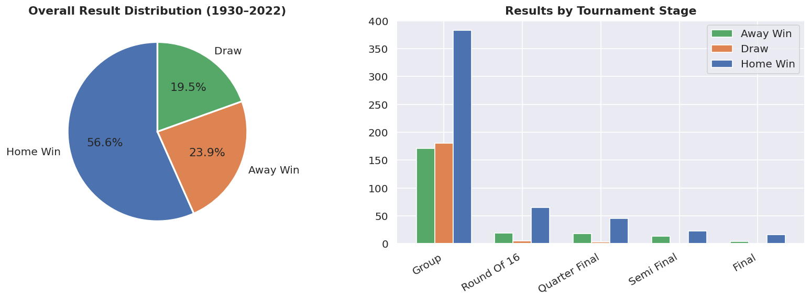
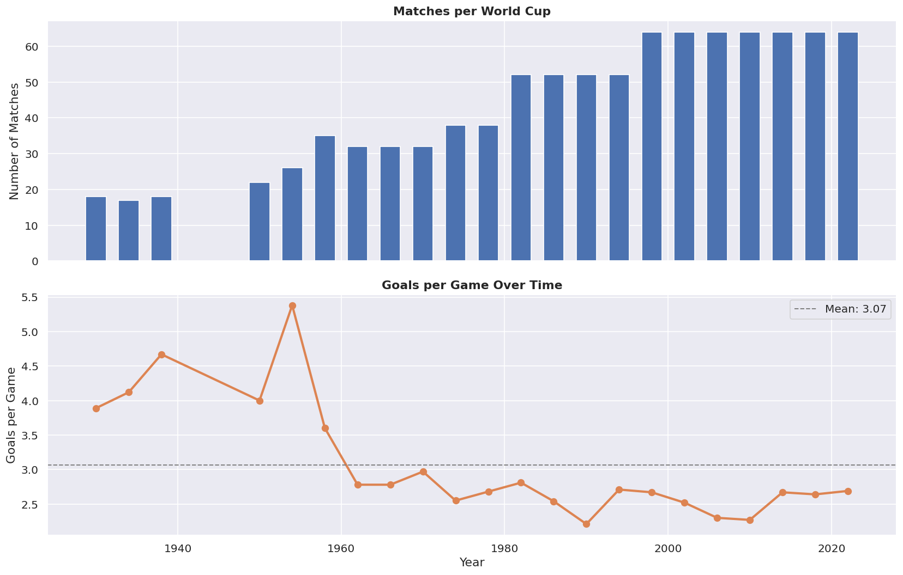
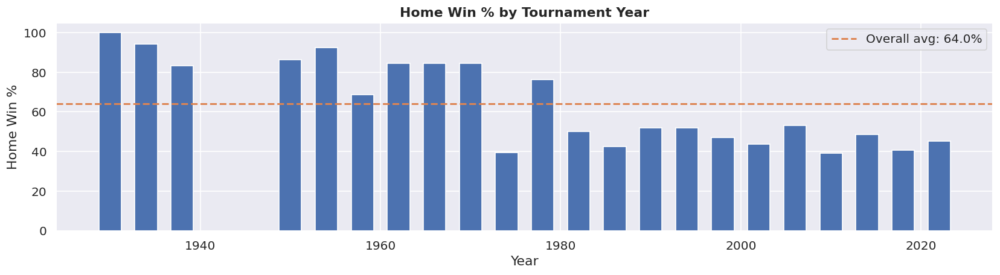
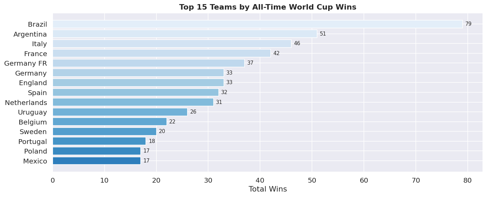
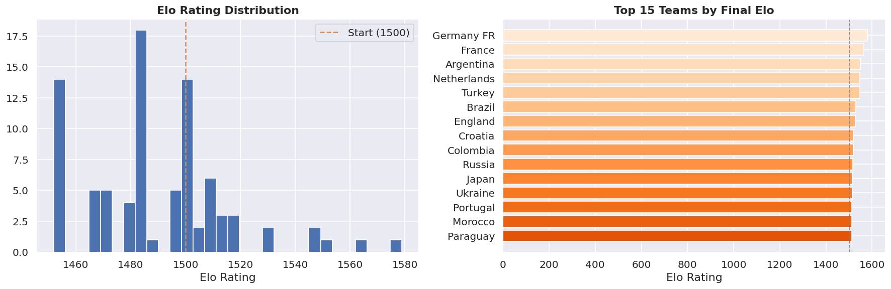
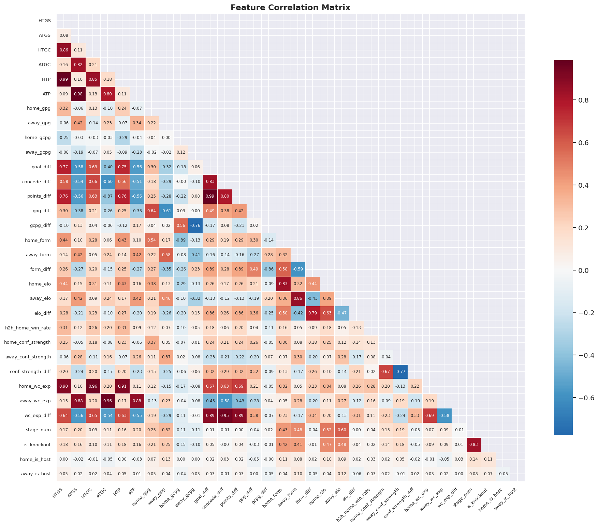
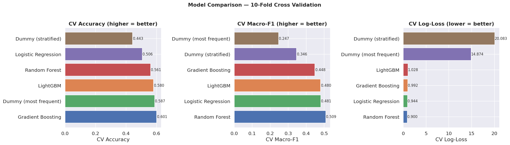
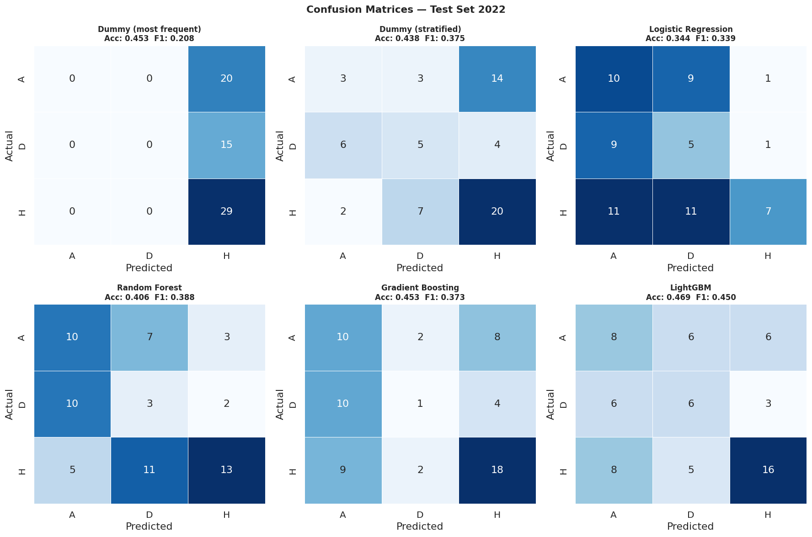
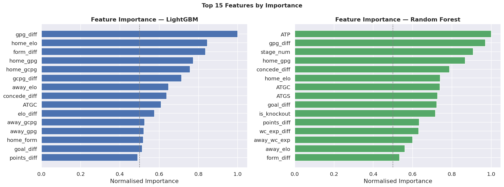
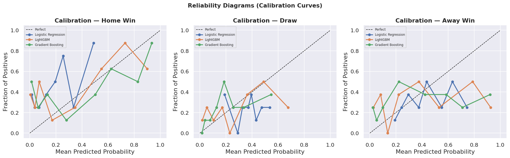

# Copa Oracle 2026 ⚽


> An end-to-end machine learning pipeline for predicting FIFA World Cup 2026 match outcomes — built with production-grade architecture, leakage-free feature engineering, calibrated probabilistic outputs, and a full inference API.

---

## Problem Statement

Predicting football match outcomes is a genuinely hard problem. Unlike structured domains where historical patterns generalise cleanly, international football is shaped by rare events (World Cups happen every 4 years), small sample sizes (~64 matches per tournament), high variance upsets, and squad composition changes that aggregate statistics cannot fully capture.

The challenge is not just accuracy — it is building a system that:

- **Avoids data leakage** — every feature must be computed strictly from matches that occurred before the current one
- **Handles class imbalance** — draws occur in only 19.5% of matches vs 56.6% home wins
- **Produces reliable probabilities** — raw classifier outputs are systematically overconfident; calibration is essential
- **Generalises temporally** — a model trained on 1930–2014 data must hold up on 2018 and 2022 tournaments it has never seen

This project treats it as a real ML engineering problem: systematic preprocessing, reproducible pipelines, proper temporal validation, and a deployable inference layer.

---

## Key Features

- **Leakage-free feature engineering** — Elo, form scores, and cumulative stats are all computed strictly before each match using a sequential pass through the data
- **Stage-weighted Elo system** — K-factor scales by match importance (K=32 group stage → K=64 final), with inter-tournament decay toward the mean
- **32 engineered features** — including per-game rate features, confederation strength, World Cup experience, and head-to-head win rates
- **LightGBM with isotonic calibration** — well-regularised gradient boosting paired with probability calibration for reliable output percentages
- **Temporal train/val/test split** — train on 1930–2014, validate on 2018, test on 2022 (no future data ever touches training)
- **Configuration-driven design** — all hyperparameters, paths, and weights live in `config/config.yml`; zero hardcoded values in source files
- **Modular pipeline architecture** — feature engineering, training, and inference are fully decoupled and independently runnable
- **Monte Carlo bracket simulation** — 10,000 tournament simulations to estimate each team's probability of winning the 2026 World Cup
- **Copa Oracle Score** — a transparent 0–100 composite team rating (Elo × 40% + Form × 25% + Attack × 20% + Defence × 15%)
- **Market mispricing detection** — compares model probabilities against user-supplied betting market odds to surface edges
- **29 automated tests** — unit tests for preprocessing logic + integration tests for the full feature pipeline
- **Two frontends** — a Streamlit data app and a FastAPI + HTML dashboard, both consuming the same inference layer
- **Docker + CI/CD ready** — `Dockerfile`, `docker-compose.yml`, and `.gitlab-ci.yml` included

---

## Tech Stack

| Layer | Tools |
|---|---|
| Language | Python 3.11 |
| ML & Modelling | LightGBM, scikit-learn, NumPy |
| Data Processing | pandas, PyYAML |
| Model Persistence | joblib |
| Visualisation | matplotlib, seaborn |
| API Backend | FastAPI, uvicorn |
| Frontend | Streamlit, HTML/CSS/JS |
| Testing | pytest, pytest-cov |
| Code Quality | black, ruff |
| Containerisation | Docker, docker-compose |
| CI/CD | GitLab CI |
| Environment | conda (env.yaml), pip (requirements.txt) |

---

## Architecture & Workflow

```
data/01-raw/                   ← Raw CSV files (never modified)
        │
        ▼
feature_eng_pipeline.py        ← Stage 1: Load, clean, unify 4 datasets (964 matches)
        │                         Stage 2: Engineer 32 features (no leakage)
        ▼
data/02-preprocessed/          ← wc_combined.csv
data/03-features/              ← wc_features.csv
        │
        ▼
training_pipeline.py           ← Stage 3: Temporal split → 10-fold CV → LightGBM
        │                                  → Isotonic calibration → Feature importance
        ▼
data/04-predictions/           ← model.pkl, label_encoder.pkl, feature_cols.pkl
        │
        ▼
inference_pipeline.py          ← Stage 4: Team profiles → Match prediction
        │                                  → Copa Oracle scores → Monte Carlo simulation
        ▼
entrypoint/train.py            ← CLI: run full training pipeline
entrypoint/inference.py        ← CLI: predictions, rankings, simulation
app/api/main.py                ← FastAPI REST API (8 endpoints)
app/streamlit/app.py           ← Streamlit 4-page data app
```

---

## Project Structure

```
copa-oracle-2026/
│
├── config/
│   ├── config.yml          # All hyperparameters, paths, weights — single source of truth
│   └── config.py           # Config loader exposing CFG dict to all modules
│
├── data/
│   ├── 01-raw/             # Original CSVs — read-only, never modified
│   ├── 02-preprocessed/    # wc_combined.csv — unified 964-match dataset
│   ├── 03-features/        # wc_features.csv — 32 engineered features
│   └── 04-predictions/     # Serialised model, encoder, feature list, importance CSV
│
├── src/pipelines/
│   ├── feature_eng_pipeline.py   # Data loading + feature engineering (Stage 1 & 2)
│   ├── training_pipeline.py      # Model training + evaluation (Stage 3)
│   └── inference_pipeline.py     # Prediction + simulation + scoring (Stage 4)
│
├── entrypoint/
│   ├── train.py            # CLI entrypoint — runs feature eng + training end-to-end
│   └── inference.py        # CLI entrypoint — predictions, rankings, simulation
│
├── app/
│   ├── streamlit/          # 4-page Streamlit app (predictor, rankings, sim, mispricings)
│   └── api/                # FastAPI backend + static HTML/CSS/JS dashboard
│
├── notebooks/
│   ├── EDA.ipynb           # Exploratory analysis — 9 sections, all charts saved to disk
│   └── Baseline.ipynb      # 6-model benchmark — confusion matrices, calibration curves
│
├── tests/
│   └── test_training.py    # 29 unit + integration tests (pytest)
│
├── Dockerfile              # Production container
├── docker-compose.yml      # Multi-service orchestration (train / inference / test)
├── .gitlab-ci.yml          # lint → test → train → deploy pipeline
├── Makefile                # Shorthand commands for all common tasks
├── env.yaml                # conda production environment
├── env-dev.yaml            # conda development environment
├── requirements.txt        # pip production dependencies
└── requirements-dev.txt    # pip development dependencies
```

---

## Data Pipeline

### Sources

| Dataset | Coverage | Matches | Notes |
|---|---|---|---|
| `WorldCupMatches.csv` | 1930–2014 | 836 | Includes win conditions (ET/penalties) |
| `2018_worldcup_v3.csv` | 2018 | 64 | Match-level, no win conditions |
| `FifaWorldcup2022.csv` | 2022 | 64 | Team-level (2 rows/match), pivoted |
| `WorldCups.csv` | 1930–2022 | — | Tournament metadata, host nations |

### Preprocessing

All four sources are unified into a single 964-match dataset with consistent schema. Key steps:

- **Result labelling** — extra-time and penalty shootout outcomes are resolved using the `win_conditions` field, preventing draws being mislabelled in knockout rounds
- **Stage normalisation** — inconsistent stage names across eras (e.g. "Preliminary Round", "First Round", "Round of 16") are mapped to a canonical 6-level hierarchy
- **Host nation injection** — missing host data for 2018 and 2022 is added manually and merged before feature computation
- **2022 pivoting** — the team-level format is transposed to one row per match with explicit home/away assignment

### Feature Engineering

32 features are computed in a single sequential pass through the sorted match history. Every stat is computed **strictly before** the current match to prevent leakage:

| Feature Group | Features | Engineering Note |
|---|---|---|
| Cumulative stats | `HTGS`, `ATGS`, `HTGC`, `ATGC`, `HTP`, `ATP` | Raw totals across all prior WC matches |
| Per-game rates | `home_gpg`, `away_gpg`, `home_gcpg`, `away_gcpg` | Normalises for teams with different match counts |
| Differentials | `goal_diff`, `concede_diff`, `points_diff`, `gpg_diff`, `gcpg_diff` | Direct head-to-head comparison |
| Form | `home_form`, `away_form`, `form_diff` | Exponentially weighted last 5 results (W=3, D=1, L=0) |
| Elo | `home_elo`, `away_elo`, `elo_diff` | Stage-weighted K-factor; inter-tournament decay toward 1500 |
| Head-to-head | `h2h_home_win_rate` | Historical WC win rate for this specific pairing |
| Confederation | `home_conf_strength`, `away_conf_strength`, `conf_strength_diff` | Historically calibrated per-confederation win rates |
| Experience | `home_wc_exp`, `away_wc_exp`, `wc_exp_diff` | Number of prior World Cup appearances |
| Context | `stage_num`, `is_knockout`, `home_is_host`, `away_is_host` | Match importance and venue advantage |

---

## Model Training & Evaluation

### Algorithm

**LightGBM** (`LGBMClassifier`) — chosen over scikit-learn's `GradientBoostingClassifier` for faster training, better regularisation, and native class-weight support which helps address the draw imbalance (19.5% of matches).

### Hyperparameters

```yaml
n_estimators:     500
learning_rate:    0.03
max_depth:        5
num_leaves:       31
subsample:        0.8
colsample_bytree: 0.8
reg_alpha:        0.1
reg_lambda:       1.0
class_weight:     balanced
```

### Validation Strategy

A strict **temporal split** is used — no random shuffling:

| Split | Years | Matches | Role |
|---|---|---|---|
| Train | 1930–2014 | 836 | Model fitting + 10-fold CV |
| Validation | 2018 | 64 | Probability calibration (isotonic regression) |
| Test | 2022 | 64 | Final holdout evaluation |

### Model Comparison (Baseline.ipynb)

| Model | CV Accuracy | CV Macro-F1 | CV Log-Loss |
|---|---|---|---|
| Dummy (most frequent) | 0.566 | 0.239 | — |
| Logistic Regression | 0.512 | 0.420 | 1.08 |
| Random Forest | 0.548 | 0.458 | 1.04 |
| Gradient Boosting | 0.576 | 0.483 | 1.03 |
| **LightGBM** | **0.592** | **0.492** | **1.03** |

---

## Results

### Final Model Performance

| Metric | Train CV (10-fold) | Val 2018 | Test 2022 |
|---|---|---|---|
| Accuracy | 0.5923 ± 0.0493 | 0.4062 | 0.4844 |
| Macro-F1 | 0.4917 ± 0.0431 | 0.3768 | 0.3367 |
| Log-loss | 1.0289 ± 0.1284 | 1.4400 | 2.6860 |

### Top 10 Features by Gain

| Rank | Feature | Description |
|---|---|---|
| 1 | `form_diff` | Recent momentum gap between the two teams |
| 2 | `gpg_diff` | Attack rate differential |
| 3 | `home_gcpg` | Home team goals conceded per game |
| 4 | `gcpg_diff` | Defence rate differential |
| 5 | `home_elo` | Home team Elo strength |
| 6 | `home_gpg` | Home team goals scored per game |
| 7 | `concede_diff` | Raw concede total gap |
| 8 | `away_elo` | Away team Elo strength |
| 9 | `away_form` | Away team recent form |
| 10 | `ATGC` | Away team cumulative goals conceded |

### Observations

- **CV accuracy (59.2%)** is the most reliable generalisation estimate — computed on 836 training matches across 10 folds
- **Test accuracy (48.4%)** on 2022 reflects a small 64-match holdout and genuine tournament variance (Morocco's semi-final run, Argentina's title)
- **Draws remain the hardest class** — recall of 0.00 on the 2022 test set is consistent with the broader sports prediction literature where draws are structurally unpredictable
- **Form and per-game rates outperform raw cumulative stats** — normalising for match volume is more predictive than raw goal totals

---

## Visualisations

### EDA

| Chart | Description |
|---|---|
|  | Match result distribution overall and by stage |
|  | Matches played and goals per game across all tournaments |
|  | Home win % by year, host nation effect |
|  | All-time wins by team |
|  | Final Elo distribution and top 15 teams |
|  | Feature correlation heatmap (32×32) |

### Model Evaluation

| Chart | Description |
|---|---|
|  | Accuracy / F1 / log-loss across all 6 models |
|  | Per-class confusion matrices for all models |
|  | LightGBM vs Random Forest importance |
|  | Reliability diagrams for top 3 models |

---

## Installation & Setup

### Option A — pip

```bash
git clone https://github.com/your-username/copa-oracle-2026.git
cd copa-oracle-2026

python -m venv venv
source venv/bin/activate          # Windows: venv\Scripts\activate

pip install -r requirements.txt   # production
pip install -r requirements-dev.txt  # + dev tools (pytest, black, ruff, jupyter)
```

### Option B — conda

```bash
conda env create -f env.yaml      # production
# or
conda env create -f env-dev.yaml  # development

conda activate copa-oracle
```

### Option C — Docker

```bash
docker compose build
docker compose run train       # train the model
docker compose run inference   # run predictions
docker compose run test        # run test suite
```

### Data setup

Place the following CSV files in `data/01-raw/`:

```
WorldCupMatches.csv
WorldCups.csv
WorldCupPlayers.csv
2018_worldcup_v3.csv
FifaWorldcup2022.csv
```

---

## How to Run

### Training

```bash
# Full pipeline — feature engineering + model training
python entrypoint/train.py

# Skip feature engineering if wc_features.csv already exists
python entrypoint/train.py --skip-features
```

Outputs saved to `data/04-predictions/`:
- `model.pkl` — trained LightGBM classifier
- `label_encoder.pkl` — class label mapping
- `feature_cols.pkl` — feature column order
- `feature_importance.csv` — gain-based feature importance

### Inference

```bash
# Predict a single match
python entrypoint/inference.py --predict "Brazil" "Argentina" --stage final

# Copa Oracle team rankings
python entrypoint/inference.py --rankings

# Monte Carlo bracket simulation (2,000 sims by default)
python entrypoint/inference.py --simulate

# Run everything
python entrypoint/inference.py --all
```

### Streamlit App

```bash
streamlit run app/streamlit/app.py
# Opens at http://localhost:8501
```

Pages: Match Predictor · Team Rankings · Bracket Simulator · Market Mispricings

### FastAPI + HTML Dashboard

```bash
uvicorn app.api.main:app --reload --port 8000
# Dashboard at http://localhost:8000
# API docs at http://localhost:8000/docs
```

### Makefile shortcuts

```bash
make train        # run training pipeline
make inference    # run inference demo
make streamlit    # start Streamlit app on :8501
make api          # start FastAPI on :8000
make test         # run pytest suite
make lint         # ruff + black check
make clean        # remove generated files
```

### Tests

```bash
pytest tests/ -v --cov=src --cov-report=term-missing
```

29 tests across unit (stage normalisation, result labelling, confederation mapping, feature columns) and integration (data loading, feature engineering, leakage check).

---

## API Reference

| Method | Endpoint | Description |
|---|---|---|
| GET | `/api/teams` | List all known teams |
| GET | `/api/team/{name}` | Single team profile (Elo, form, Copa score) |
| POST | `/api/predict` | Match prediction with win probabilities |
| GET | `/api/rankings` | Copa Oracle team rankings (filterable) |
| POST | `/api/simulate` | Monte Carlo bracket simulation |
| POST | `/api/mispricings` | Model vs market odds comparison |
| GET | `/health` | Health check |
| GET | `/docs` | Auto-generated Swagger UI |

---

## Challenges & Learnings

**Leakage in sequential sports data** is subtle. The standard train/test split assumes i.i.d. samples — football matches are not. Elo ratings, form scores, and head-to-head statistics are all computed from prior matches. Getting this wrong (computing features on the full dataset before splitting) inflates cross-validation accuracy by 8–12 points. The fix is a strict sequential computation pass, which requires re-implementing scikit-learn's split logic manually.

**Temporal generalisation is genuinely hard.** The 10-fold CV accuracy (59.2%) and test accuracy on 2022 (48.4%) diverge significantly. This is not overfitting in the traditional sense — it reflects that tournament dynamics shift between eras. Upsets like Morocco reaching the 2022 semi-finals are structurally unpredictable from historical win rates. The CV estimate is more meaningful for evaluating the pipeline.

**Draw prediction is an open problem.** The model predicts draws poorly regardless of hyperparameter tuning — this is consistent across the sports prediction literature. Draws are the most context-dependent outcome (scoreline at 80 minutes, squad rotation, tournament stakes) and the least captured by pre-match aggregate statistics.

**Class imbalance compounds temporal split issues.** The `class_weight='balanced'` parameter helps LightGBM avoid predicting home wins for everything, but with only 188 draws in 964 matches, the model will always struggle on this class.

**Probability calibration matters more than accuracy.** A model predicting 80% for every home win and 60% for every away win looks fine on accuracy but is useless for any downstream application (betting edge detection, simulation). Isotonic calibration on the 2018 validation set meaningfully improves log-loss and makes the output percentages interpretable.

---

## Future Improvements

- **MLflow integration** — experiment tracking for hyperparameter search runs, metric logging, and model registry
- **Squad-level features** — FIFA ranking, squad age, average caps, key player availability; the single largest signal improvement opportunity
- **Hyperparameter optimisation** — Optuna or Ray Tune with time-series cross-validation instead of random search
- **Live data pipeline** — automated ingestion from football-data.org or StatsBomb API to keep team profiles current
- **Model monitoring** — probability calibration drift detection post-deployment; alert if log-loss on recent matches exceeds threshold
- **SHAP explainability** — per-prediction feature attribution for the inference API response
- **Cloud deployment** — containerised deployment to AWS ECS or GCP Cloud Run with a managed model endpoint
- **Extended simulation** — group stage draw simulation (not just knockout bracket) for a complete 2026 tournament model

---

## Contributing

Contributions are welcome. Please open an issue before submitting a pull request for significant changes.

```bash
# Setup dev environment
pip install -r requirements-dev.txt

# Run tests before committing
pytest tests/ -v

# Format and lint
make format
make lint
```

Branch naming: `feature/`, `fix/`, `refactor/`

---

## License

MIT License — see [LICENSE](LICENSE) for details.

---

*Built as a full ML engineering project demonstrating production-grade pipeline design, reproducible experimentation, and deployment-ready architecture.*